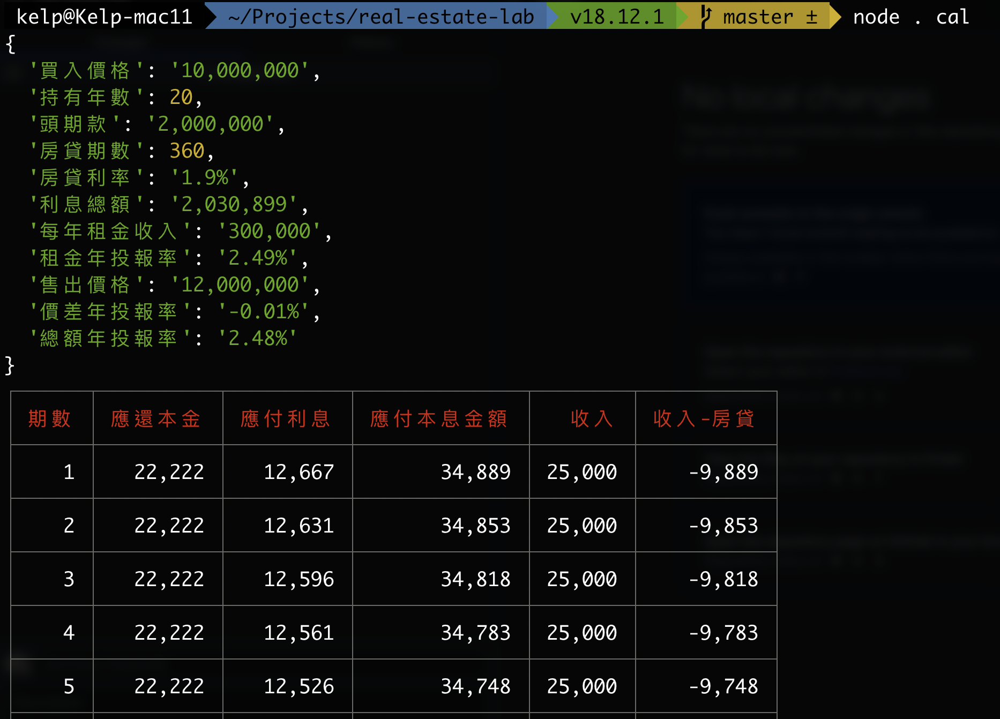

# real-estate-lab


## Installation
```bash
git clone https://github.com/kelp404/real-estate-lab.git
cd real-estate-lab
npm install
```


## How to use?
### 1. Modify [index.js](index.js).
```js
// 房價(元)
const BUY_PRICE = 1000 * 10000;
// 頭款佔比(%)
const INITIAL_AMOUNT_RATE = 20;
// 貸款期數(月)
const LOAN_MONTHS = 360;
// 房貸年利率(%)
const LOAN_RATE = 1.9;
// 每年房租收入(元)
const YEARLY_RENT = 30 * 10000;
// 房屋持有時間(月)
const OWN_MONTHS = 240;
// 房屋出售價格(元)
const SELL_PRICE = 1200 * 10000;
```
### 2. Run calculate command
```bash
node . cal
```


